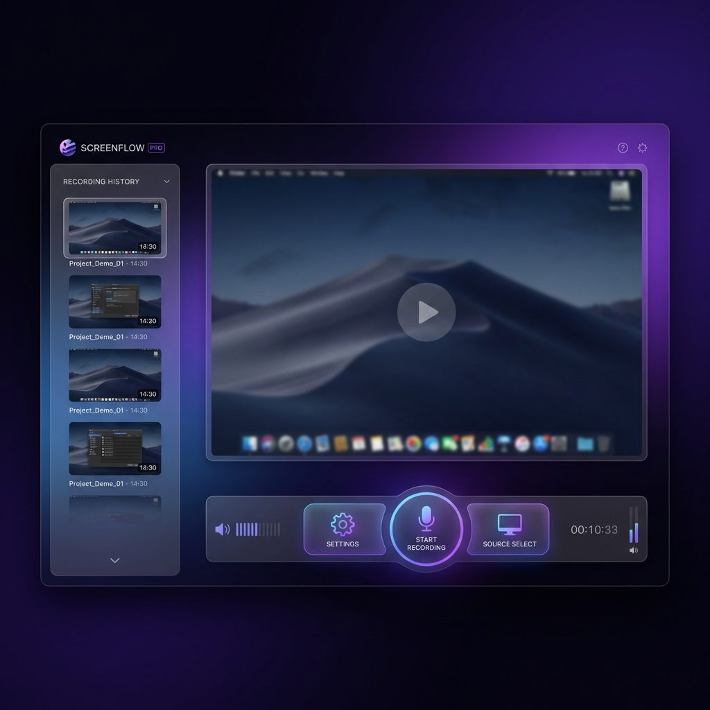

# 🎥 SCREENFLOW PRO : L'Élite de l'Enregistrement Écran



## 💎 Valorisé à 30$/mois... Aujourd'hui GRATUIT (Beta Publique)

**Screenflow Pro** transforme votre ordinateur en studio de production. Conçu pour ceux qui exigent la perfection, il combine un design futuriste et une puissance de capture inégalée.

Actuellement en phase **Beta**, toutes les fonctionnalités Premium sont **accessibles gratuitement**. Profitez-en avant le lancement officiel de l'abonnement à 30$/mois !

---

## 🚀 Guide Rapide (Noob-Friendly)

Pas besoin d'être un expert en informatique pour commencer à créer.

### 1. Installation (En 1 clic)

- **Sur Windows** : Téléchargez le dossier, et double-cliquez sur `run.bat`. C'est tout.
- **Sur Mac/Linux** : Ouvrez un terminal dans le dossier et tapez `./run.sh`.

### 2. Comment enregistrer ?

1.  **Choisissez votre source** : Cliquez sur "Select Source" et choisissez votre écran ou une fenêtre.
2.  **Réglez le son** : Utilisez les sliders pour ajuster le volume du micro et du système.
3.  **Action !** : Appuyez sur le bouton **Start** (ou utilisez le raccourci magique `Ctrl + Shift + R`).
4.  **Terminé** : Appuyez sur **Stop** (ou `Ctrl + Shift + S`). Une fenêtre s'ouvrira pour enregistrer votre chef-d'œuvre.

---

## ✨ Les Fonctionnalités qui font la différence

### 🛸 Design "Glassmorphism"

Une interface transparente et élégante qui ne gâche pas votre bureau. C'est beau, c'est fluide, c'est pro.

### 🎙️ Mixage Audio de Studio

Marre des vidéos où on n'entend pas votre voix ? Avec nos sliders de **Gain en Direct**, mixez votre micro et le son de votre PC comme un ingénieur du son.

### ⌨️ Commandes "Ninja" (Raccourcis)

Plus besoin de chercher la fenêtre de l'app pour arrêter l'enregistrement :

- `Ctrl + Shift + R` pour **Démarrer** 🔴
- `Ctrl + Shift + S` pour **Arrêter** ⬛

---

## 🛠️ Installation pour les Développeurs

Si vous voulez cloner le projet et le modifier :

```bash
# Cloner le projet
git clone https://github.com/DeamonDev888/screen_recorder.git

# Entrer dans le dossier
cd screen_recorder

# Installer les outils
pnpm install

# Lancer la magie
pnpm run dev
```

---

## 📁 Structure du Projet

- `public/assets/` : Les visuels premium.
- `src/` : Le moteur ultra-puissant en TypeScript.
- `run.bat` : Votre télécommande magique pour Windows.

---

## 📜 Licence

Projet fier d'être sous licence **MIT**. Gratuit, ouvert et puissant.

---

**Rejoignez l'élite des créateurs. Le futur de l'enregistrement commence ici.** 🚀
[Visitez le GitHub](https://github.com/DeamonDev888/screen_recorder.git)
