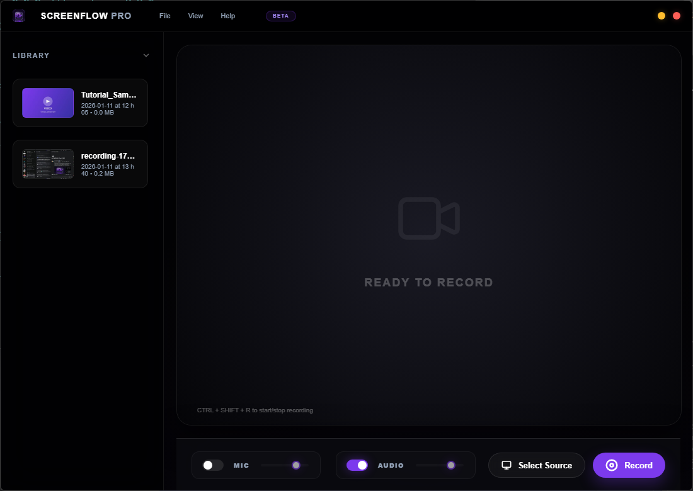
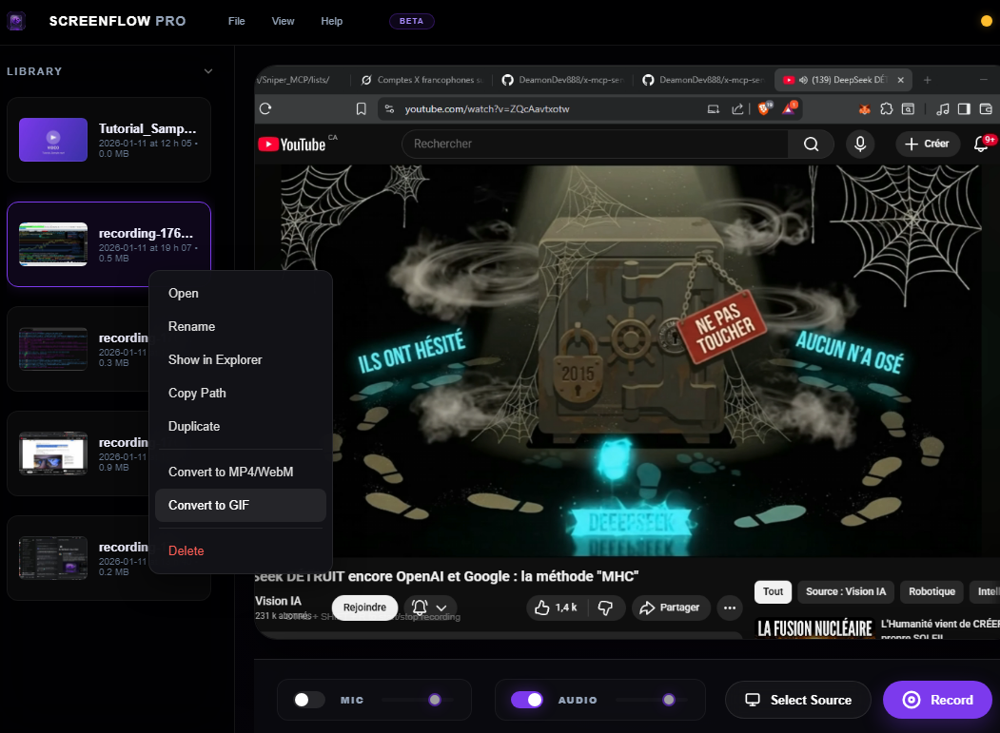
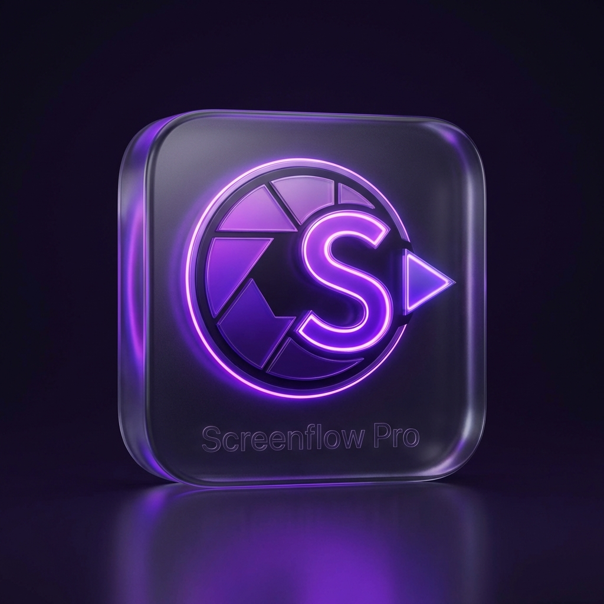

# 🎥 SCREENFLOW PRO

L'outil d'enregistrement d'écran professionnel pour Windows.



---

## ✨ Fonctionnalités

### 🎬 Enregistrement d'Écran

- **Capture d'écran complet** ou de fenêtres spécifiques
- **Sélecteur visuel** avec aperçus en temps réel
- **Format WebM** avec codec VP9 (haute qualité)
- **Enregistrement audio** du système et/ou du micro

### 🎙️ Mixage Audio

- **Contrôles indépendants** pour le micro et le son système
- **Sliders de volume** en temps réel
- **Mixage intelligent** via Web Audio API
- **Mute automatique** de l'aperçu (pas de feedback)

### 📁 Bibliothèque Intégrée

- **Miniatures automatiques** pour chaque enregistrement
- **Gestion contextuelle** : Open, Rename, Show in Explorer, Copy Path, Delete
- **Métadonnées** : taille, date de modification
- **Aperçus visuels** des vidéos

### ⌨️ Raccourcis Clavier

- **Ctrl+Shift+R** : Démarrer/Arrêter l'enregistrement
- **Ctrl+B** : Afficher/Masquer la barre latérale
- **F11** : Plein écran

### 🔄 Conversion Vidéo

- **Formats supportés** : MP4, WebM, GIF
- **Optimisations GIF** : Taille réduite et framerate adapté
- **Génération automatique** de nouvelles miniatures après conversion
- **Smart Renaming** : Évite d'écraser les fichiers existants

---

## 🖼️ Aperçu de l'Interface

### Interface Principale


**Composants de l'interface :**

- **Barre de titre** personnalisée avec menus File, View, Help
- **Barre latérale** (Library) avec historique des enregistrements
- **Zone de preview** avec aperçu vidéo en temps réel
- **Barre de contrôle** avec paramètres audio et boutons d'enregistrement
- **Sélecteur de source** avec grille visuelle

### Sélection de Source


Le sélecteur de source affiche :

- **Tous les écrans** disponibles
- **Toutes les fenêtres** ouvertes
- **Miniatures en temps réel** de chaque source
- **Grille responsive** pour facile navigation

### Conversion de Format



La conversion permet de :

- Transformer vos **WebM** en **MP4** compatibles partout
- Créer des **GIFs animés** pour les réseaux sociaux
- Garder la trace de la conversion avec les miniatures mises à jour

---

## 🚀 Installation

### Prérequis

- Windows 10/11
- Node.js 18+ (pour le développement)

### Installation rapide

```bash
# Cloner le repository
git clone https://github.com/votre-repo/screen-recorder.git
cd screen-recorder

# Installer les dépendances
npm install

# Compiler le projet
npm run build

# Lancer l'application
npm start
```

### Scripts disponibles

```bash
npm start          # Lancer l'application
npm run build      # Compiler TypeScript
npm run watch      # Mode développement avec recompilation auto
npm start:clean   # Lancer sans les erreurs WGC (logs filtrés)
npm run thumbnails # Régénérer les thumbnails manuellement
```

---

## 📖 Guide d'Utilisation

### 1. Sélectionner une Source

Cliquez sur **"Select Source"** et choisissez :

- Un écran complet
- Une fenêtre spécifique
- Un onglet de navigateur

### 2. Configurer l'Audio

Dans la barre de contrôle :

- **Mic** : Activer/Désactiver l'enregistrement du micro
- **Audio** : Activer/Désactiver le son système
- **Sliders** : Ajuster le volume de chaque source

### 3. Enregistrer

- Cliquez sur **"Record"** (ou **Ctrl+Shift+R**)
- Le bouton devient **"Stop"** (rouge)
- Un compteur s'affiche en temps réel
- Cliquez sur **"Stop"** pour terminer

### 4. Sauvegarder

La boîte de dialogue de sauvegarde s'ouvre automatiquement :

- Choisissez le nom et l'emplacement
- Cliquez sur **"Save Recording"**
- La miniature est générée automatiquement

### 5. Gérer les Enregistrements

Dans la bibliothèque (barre latérale) :

**Clic droit sur une vidéo pour :**

- **Open** : Ouvrir la vidéo
- **Rename** : Renommer le fichier
- **Show in Explorer** : Afficher dans l'explorateur de fichiers
- **Copy Path** : Copier le chemin du fichier
- **Delete** : Supprimer (déplace vers la corbeille)

---

## 🛠️ Développement

### Structure du Projet

```
screen_recorder/
├── public/
│   ├── index.html          # Interface utilisateur
│   └── assets/             # Images et icônes
├── src/
│   ├── main.ts            # Processus principal (Electron)
│   ├── preload.cts        # Pont IPC sécurisé
│   └── renderer.ts        # Processus de rendu
├── Library/                # Enregistrements sauvegardés
└── dist/                   # Code JavaScript compilé
```

### Technologies Utilisées

- **Electron 33** - Framework d'application desktop
- **TypeScript 5** - Typage statique
- **Web Audio API** - Mixage audio en temps réel
- **MediaRecorder API** - Capture vidéo
- **Canvas API** - Génération de thumbnails

---

## 🎨 Personnalisation

### Modifier les couleurs

Dans `public/index.html`, modifiez les variables CSS :

```css
:root {
  --accent: #7c3aed; /* Violet principal */
  --accent-light: #a78bfa; /* Violet clair */
  --bg: #030305; /* Fond principal */
}
```

### Modifier la taille de la fenêtre

Dans `src/main.ts` :

```typescript
const win = new BrowserWindow({
  width: 1100, // Largeur
  height: 780, // Hauteur
  // ...
});
```

---

## 🐛 Résolution de Problèmes

### Erreurs WGC dans la console

Si vous voyez des erreurs `ProcessFrame failed: -2147467259` :

**C'est normal !** Ces erreurs sont :

- ✅ **Harmless** - L'enregistrement fonctionne parfaitement
- ✅ **Cosmétiques** - Juste des messages de log
- ✅ **Connues** - Bug de Chromium/Electron sur Windows 10/11

**Pour masquer ces erreurs**, utilisez :

```bash
npm run start:clean
```

Voir [WGC_ERRORS.md](WGC_ERRORS.md) pour plus de détails.

### Thumbnails manquants

Si les thumbnails ne s'affichent pas (fond violet avec icône) :

1. **Régénérer les thumbnails :**

   ```bash
   npm run thumbnails
   ```

2. **Faire un nouvel enregistrement** pour tester la génération automatique

3. **Vérifier que la preview** est visible avant d'arrêter l'enregistrement

---

## 📝 Notes Techniques

### Performance

- **Taux d'échantillonnage** : 30 FPS (configurable)
- **Résolution maximale** : 1920x1080 (configurable)
- **Codec vidéo** : VP9 (WebM)
- **Qualité thumbnail** : JPEG 80%, 320x180 pixels

### Sécurité

- **Context Isolation** activé (isole le renderer de Node.js)
- **Sandbox** désactivé (nécessaire pour desktopCapturer)
- **Node Integration** désactivé dans le renderer
- **Opérations de fichiers** via IPC uniquement (main process)

### Compatibilité

- **Windows 10/11** ✅
- **macOS** 🔄 (partiellement testé)
- **Linux** 🔄 (partiellement testé)

---

## 📄 Licence

Projet sous licence **MIT**.

Libre d'utilisation, de modification et de distribution.

---

## 🤝 Contribution

Les contributions sont les bienvenues !

1. Fork le projet
2. Créer une branche (`git checkout -b feature/AmazingFeature`)
3. Commit les changements (`git commit -m 'Add AmazingFeature'`)
4. Push vers la branche (`git push origin feature/AmazingFeature`)
5. Ouvrir une Pull Request

---

## 📧 Support

Pour questions, bugs ou suggestions :

- **Issues** : [GitHub Issues](https://github.com/votre-repo/screen-recorder/issues)
- **Discussions** : [GitHub Discussions](https://github.com/votre-repo/screen-recorder/discussions)

---

**Développé avec ❤️ en utilisant Electron & TypeScript**


